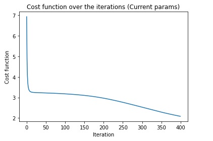
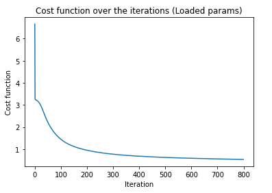

# Neural Network Train

## Overview

This project implements a Neural Network from scratch using NumPy to classify hand-written digits from a dataset. It demonstrates forward propagation, backpropagation, and gradient descent for optimizing the network.

The dataset consists of 400-pixel grayscale images (20x20) of digits from 0 to 9. The network has:
- **Input Layer**: 400 neurons
- **Hidden Layer**: 25 neurons
- **Output Layer**: 10 neurons (one for each digit)

## Dataset
The notebook loads two `.mat` files:
- **`data.mat`** → Contains input images (`X`) and labels (`y`).
- **`weights.mat`** → Contains pre-trained weight matrices (`Theta1`, `Theta2`).

## Visualization
The training process is monitored using a cost function graph. As iterations increase, the cost function should decrease, indicating improved performance. 

## Results
- After 400 iterations, the model achieves ~68% accuracy.
- Pre-trained weights from 800 iterations yield even better performance, around ~94.36 %.

## Contact

For any questions or collaboration opportunities, feel free to reach out at [hey@njoguevans.me](mailto:hey@njoguevans.me).
